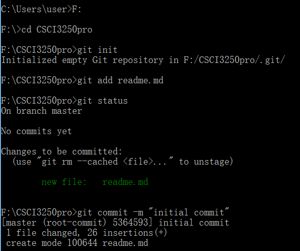

# Briefing Sharing 
## Introduction
Hi, my classmates, welcome to this repository, I am Ryan Yuxin LI, some close friends also call me Ryan Garcia, you can call me Ryan if it's more convenience.
As a yr2 CS student in ELITE Stream, I often work very hard and enjoy studying in the university library. But I think working smart is much better than working hard. So I would like to exchange the good idea about learning with outstanding peers. It's my pleasure to recognise all of your guys and make friends with your in this precious opportunity. And I am also looking for the friends who are willing to learn and try their best to improve themself in the academic. If you want to find a good friend,don't be shy, feel free to find me.

## Plan for summer
Summer is coming! I am going to do internship in the Efinix Ltd. HK as a full time software engineer. That's a exciting chance to implement my knowledge learnt from class in practice. My first step in CS career is coming soon. I will try my best to do it.

## Personnal skills
Programming languages are the one of the most vital skills for CS students:
What I have learnt is following:

| Programming Languages| Level |
|:-----------------------:| :----------------: |
| C                     | Proficient    |
| Python                | Proficient    |
| Java                  | Fair          |
| Cython                | Little        |
| Node.JS               | Fair          |
| HTML                  | Little        |
| CSS                   | Little        |
| ajax                  | Fair          |
| MySQL                 | Little        |

## Plan for this semester
But now, I have to complete some tasks in CSCI3250+3251 first:

- [x] github challenges
- [ ] prepare for quiz
- [ ] indivisual report

## command for cmd

